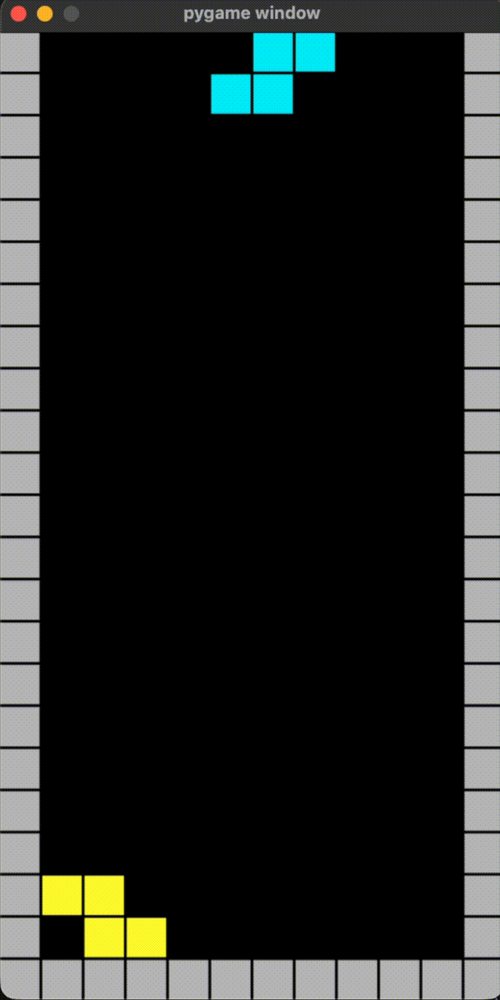

# Tetris AI using Reinforcement Learning

The main objective of this project is to train an Agent to achieve the best possible score at Tetris.

The Agent is trained using a Deep Q-Network (DQN), a Q-learning variant based on a neural network used to approximate the Q-function when the number of possible states becomes too large to fit in a Q-table.




## description

The input of the neural network is a simplified game state, instead of the full 1-bit grid. This is done to drastically reduce both the training time and the complexity of the neural network architecture (a grid representation would require a more complex convolutional network).

The state consists of a list of column heights and holes.
The output returns the Q-value for a given state. There are 2 hidden layers of size 128 ( it’s a good tradeoff between training speed & precision)

This approach is therefore an afterstate evaluation of Q: the network is evaluated on all possible next states from the current state (up to 40), and the best Q-value is selected.

This differs from the classic Atari DQN approach, where the network directly outputs the action to take.
I tried this approach with different network architectures, but it did not perform well.
I think it would require much more training.

NB: for training stability, a second DQN is used and updated every 500 steps (the loss of the next state is computed using the second DQN and backpropagated to the first network).

## usage
### install
```
pip install -r requirements.txt
```

### run the Snake agent with the current model 
```
python3 ui.py
```

### train a new agent
```
python3 train.py
```
